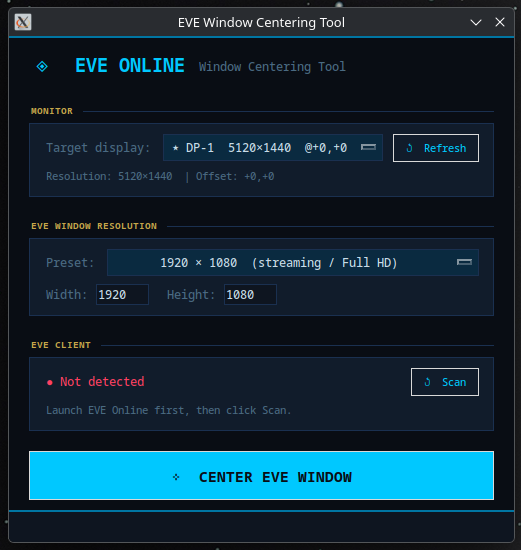
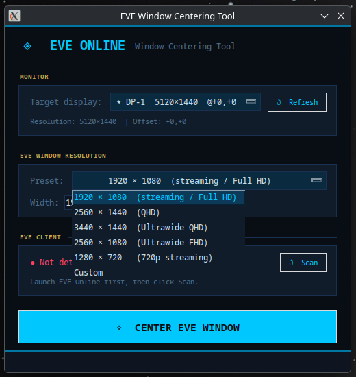

# ◈ EVE Online Window Centering Tool

A lightweight Python/tkinter utility for centering EVE Online client windows on ultrawide monitors when streaming or recording with OBS. Built and tested on **Fedora KDE Plasma 43**.

> Created for content creators who want to stream or record EVE Online with OBS while running the client in **Fixed Window** mode at a lower resolution — keeping it perfectly centered on your ultrawide display.

---

## Screenshots

| Main View | Preset Selection |
|-----------|-----------------|
|  |  |

---

## Features

- **Auto detects your monitors** via `xrandr` picks your primary display automatically
- **Resolution presets** for common streaming resolutions (1080p, 720p, QHD, Ultrawide)
- **Custom resolution** input for any fixed window size
- **Single & Dual client modes** center one window or place two EVE clients side by side on your ultrawide
- **Live layout preview** see exactly where windows will land before applying
- **EVE client detection** scans for running EVE windows via `xdotool`
- **Works via XWayland** compatible with Wayland desktops running EVE through Proton/Wine
- **Eve themed UI** dark interface styled to match the EVE aesthetic

---

## Support
If you enjoy my work, feel free to buy me a coffee!

[](https://ko-fi.com/U7U31XQGE8)

## Requirements

### System
- Linux with **X11 or XWayland** (Wayland via KDE Plasma works)
- Python 3.10+
- `xdotool`
- `python3-tkinter`

### Install dependencies (Fedora/RHEL)

```bash
sudo dnf install xdotool python3-tkinter
```

### Install dependencies (Ubuntu/Debian)

```bash
sudo apt install xdotool python3-tk
```

---

## Installation

```bash
# Clone the repository
git clone https://github.com/YOUR_USERNAME/eve-center.git
cd eve-center

# Make executable
chmod +x eve_center.py

# Run
python3 eve_center.py
```

---

## Usage

### EVE Online setup
1. Open the **EVE launcher** → Settings → Display
2. Set display mode to **Fixed Window**
3. Set your desired resolution (e.g. `1920×1080` for 1080p streaming)
4. Launch EVE Online

### Using the tool
1. Run `python3 eve_center.py`
2. Your monitor is autodetected under **MONITOR** click **↺ Refresh** if needed
3. Select a **preset** or enter a custom Width/Height matching your EVE window
4. Choose **Single Client** or **Dual Clients** mode
5. Click **↺ Scan** to detect running EVE windows
6. Click **⊹ APPLY LAYOUT** — your window(s) snap into place

### Dual client (ultrawide side-by-side)
In **Dual Clients** mode, the tool splits your display in half horizontally and centers each EVE window in its own half. On a `5120×1440` ultrawide with `1920×1080` windows, each client gets `2560px` of space with equal margins.

---

## OBS Streaming Tip

1. Set EVE to Fixed Window at `1920×1080`
2. Run this tool to center it on your `5120×1440` display
3. In OBS, add a **Window Capture** source and select the EVE window
4. OBS captures only the `1920×1080` window — clean stream, no black bars

---

## Tested On

| Component | Version |
|-----------|---------|
| OS | Fedora Linux 43 |
| Desktop | KDE Plasma 6.6.1 |
| Display Server | Wayland (XWayland for EVE) |
| Python | 3.12 |
| xdotool | 3.20211022.1 |

---

## Troubleshooting

**EVE window not detected after clicking Scan**
- Make sure EVE Online is fully launched (past the login screen)
- The tool searches for windows named `EVE` — verify with: `xdotool search --name EVE`

**Window moves to wrong position**
- Ensure `GDK_BACKEND=x11` is set (the script sets this automatically)
- On multi-monitor setups, confirm the correct display is selected in the **MONITOR** dropdown

**xdotool not found**
- Install it: `sudo dnf install xdotool` (Fedora) or `sudo apt install xdotool` (Ubuntu)

**No displays detected**
- Run `xrandr --current` in a terminal to verify your display is recognized

---

## Optional: Desktop Shortcut (KDE)

Create a `.desktop` file so the tool appears in your KDE app menu:

```bash
cat > ~/.local/share/applications/eve-center.desktop << 'EOF'
[Desktop Entry]
Name=EVE Center Tool
Comment=Center EVE Online windows for streaming
Exec=python3 /path/to/eve_center.py
Icon=utilities-system-monitor
Type=Application
Categories=Game;Utility;
EOF
```

Replace `/path/to/eve_center.py` with the actual path.

---

## License

MIT License free to use, modify, and share.

---

## Contributing

Pull requests welcome! If you've tested on a different distro or desktop environment, feel free to open an issue or PR with compatibility notes.
